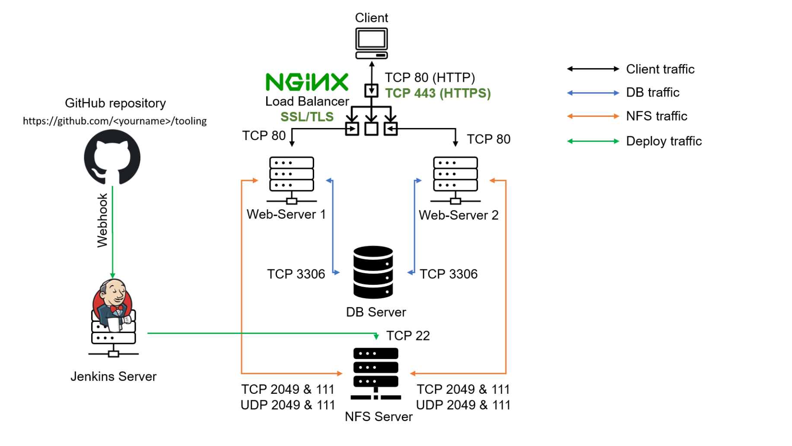
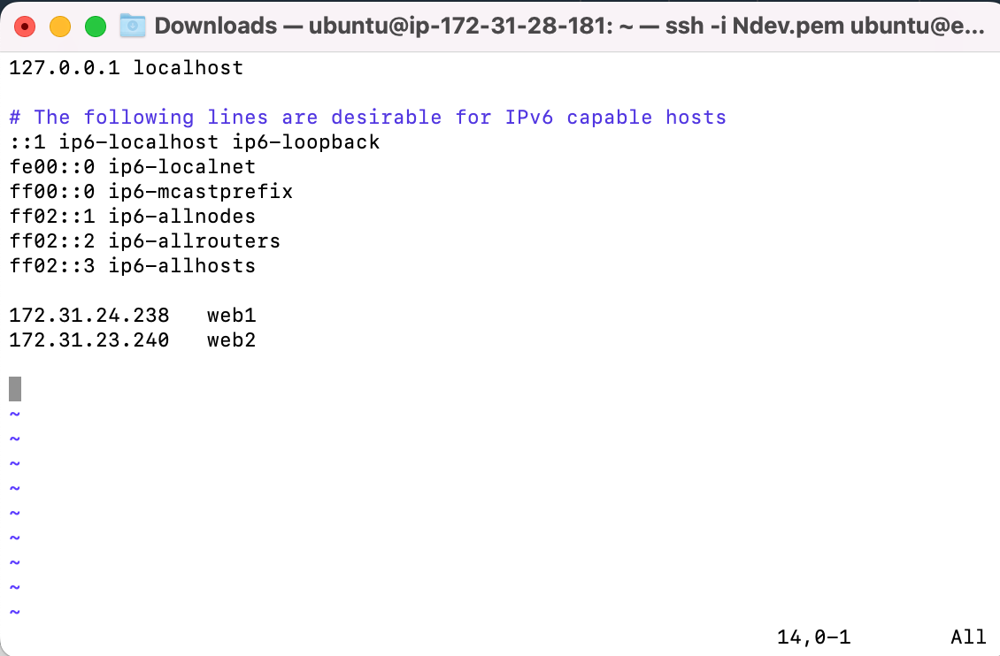
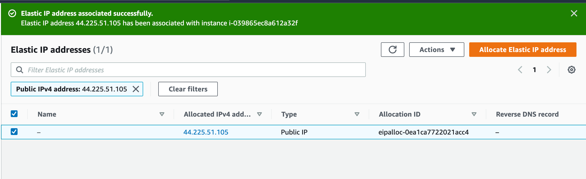
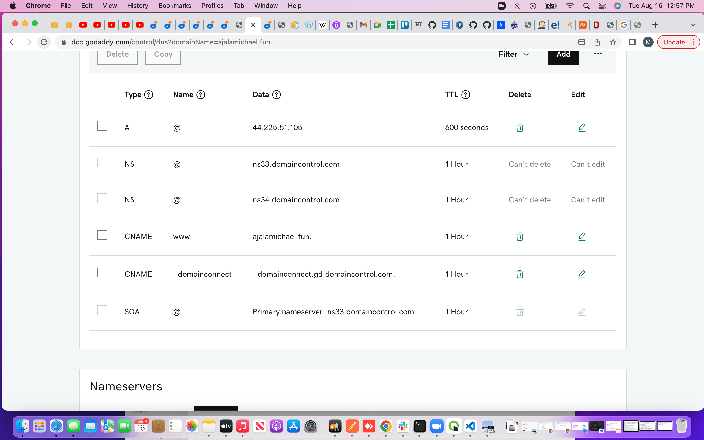
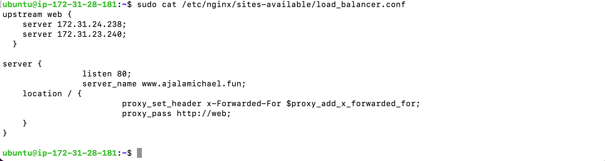
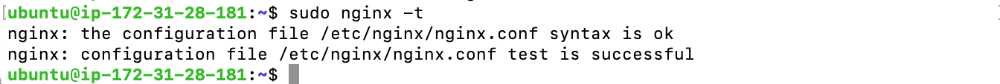
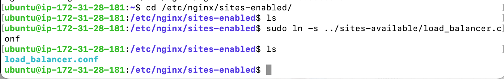
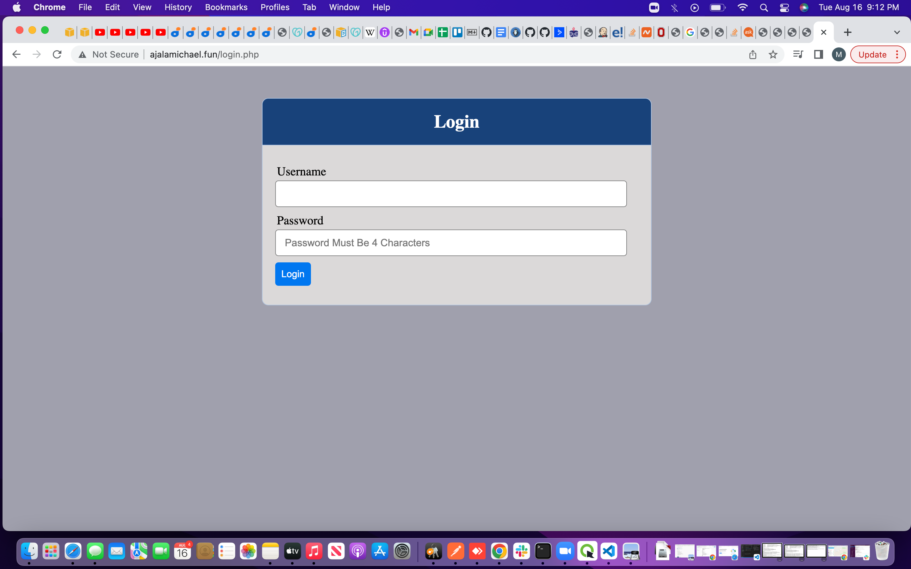
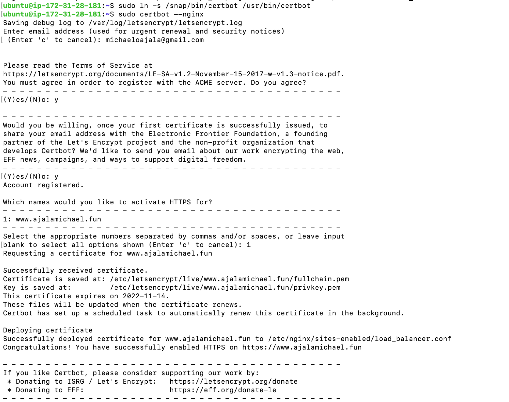
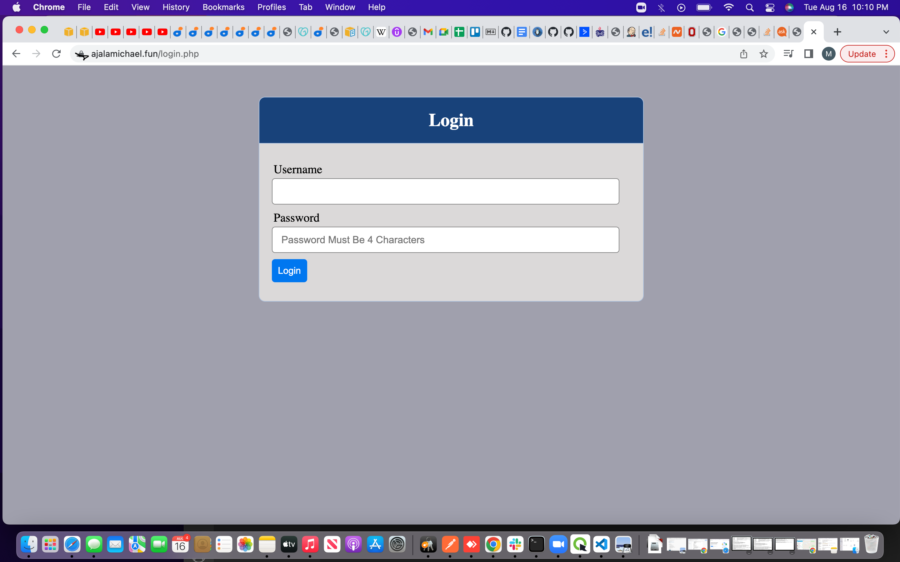

# LOAD BALANCER SOLUTION WITH NGINX AND SSL/TLS

The purpose of this project is to register a website with LetsEnrcypt Certificate Authority, to automate certificate issuance we will use a shell client recommended by LetsEncrypt.

Tasks to be done

- Configure Nginx as a Load Balancer then
- Register a new domain name and configure secured connection using SSL/TLS certificates
the target architecture will look like this:



### CONFIGURE NGINX AS A LOAD BALANCER

- Created an EC2 VM based on Ubuntu Server 20.04 LTS and named it Nginx LB. Opened TCP port 80 for HTTP connections, also opened TCP port 443 – this port is used for secured HTTPS connections.

- Updated /etc/hosts file for local DNS with Web Servers’ names (e.g. Web1 and Web2) and their local IP addresses
 
```
sudo vi /etc/hosts
```


- Installed and configure Nginx as a load balancer to point traffic to the resolvable DNS names of the webservers.

```
sudo apt update
sudo apt install nginx
sudo systemctl enable nginx
sudo systemctl start nginx
sudo systemctl status nginx
```

- Configured Nginx LB using Web Servers' names defined in /etc/hosts

```
sudo vi /etc/nginx/sites-available/load_balancer.conf
```

- Inserted the following configuration into the file

```
upstream web { 
    server 172.31.24.238;
    server 172.31.23.240;
  }   

server {
    		listen 80; 
    		server_name www.domain.com;
    location / {
			proxy_set_header x-Forwarded-For $proxy_add_x_forwarded_for;
      			proxy_pass http://web; 
    }
  } 
```

- Restarted Nginx and made sure it's up and running

```
sudo systemctl restart nginx
sudo systemctl status nginx
```

### REGISTERED A NEW DOMAIN NAME AND CONFIGURED A SECURED CONNECTION USING SSL/TLS CERTIFICATES

- Registered a new domain (ajalamichael.fun) on godaddy.com 

- Assigned an Elastic IP to the Nginx LB server and associate the domain name with this Elastic IP address. 



*the above image shows that an elastic ip address was created aand associated to Nginx LB server*

- Associated the domain name to the Elastic IP



- Configured Nginx to recognize the domain name by updating the loadbalancer.conf file

```
sudo vi /etc/nginx/sites-available/load_balancer.conf
```



- Then ran the command below to remove the default site so the reverse proxy will be directing to our new config. File

```
sudo rm -f /etc/nginx/sites-enabled/default
```

- Checked if nginx is successfully configured

```
sudo nginx -t
```



- linked the load balancer config  file to  site enabled file so that the nginx can access the configuration file

```
cd /etc/nginx/sites-enabled/

sudo ln -s ../sites-available/load_balancer.conf
```


- then restarted nginx 
```
sudo systemctl restart nginx
```

- Checked that the Web Servers can be reached from browser using the new domain name using HTTP protocol - http://<your-domain-name.com>.




- confirmed the status of snapd service if it's up and running

```
sudo systemctl status snapd
```

- Installed certbot and request for an SSL/TLS certificate
```
sudo snap install --classic certbot
```

```
sudo ln -s /snap/bin/certbot /usr/bin/certbot
sudo certbot --nginx
```

NB the domain name would be extracted fromn the nginx conf. file so it's important the file must have been updated with the domain name.



- Accessed the website by using HTTPS protocol (that uses TCP port 443)



*the image above shows that the SSL/TLS certificate has been succesfully issued for the website*

- Set up periodical renewal for the SSL/TLS certificate

NB By default, LetsEncrypt certificate is valid for 90 days, so it is recommended to renew it at least every 60 days or more frequently.

- tested renewal command in dry-run mode

```
sudo certbot renew --dry-run
```

- Best pracice is to have a scheduled job that to run renew command periodically. on that note cronjob was configured to run the command twice a day. The crontab file was editted with the command below:

```
crontab -e
```

- Added the following line:

```
* */12 * * *   root /usr/bin/certbot renew > /dev/null 2>&1
```

NB  The interval of the cronjob can be changed if the twice a day is too often by adjusting schedule expression.

PROJECT COMPLETED.

